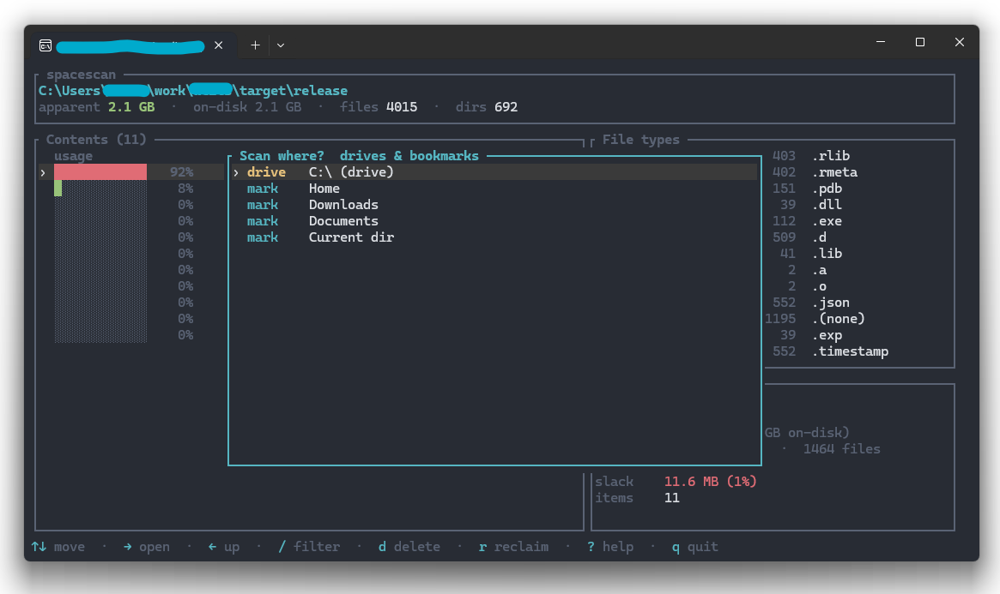
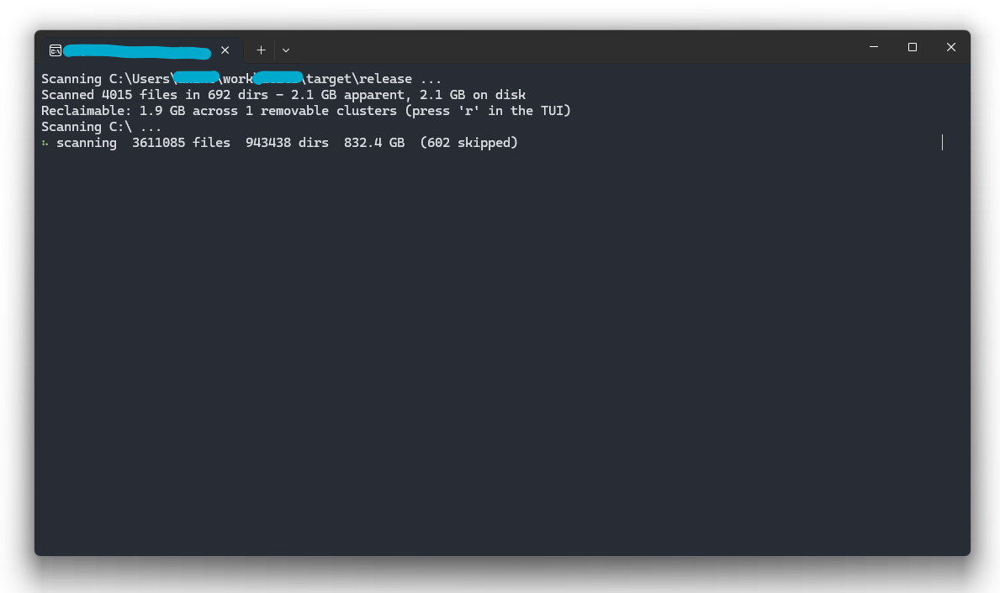
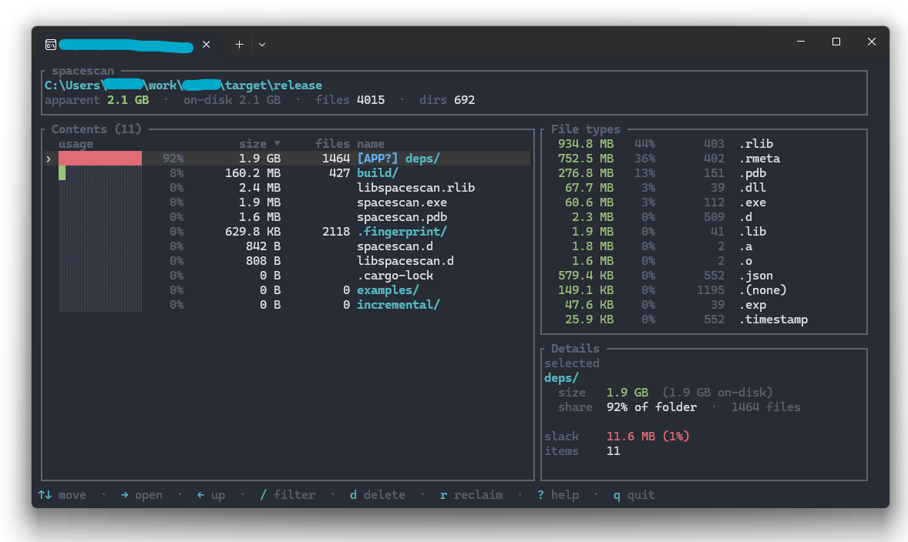
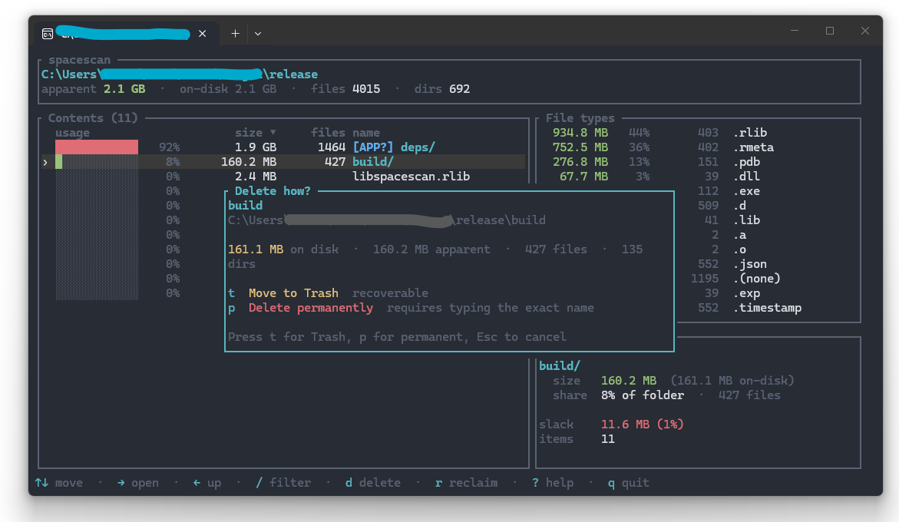

# spacescan

<p align="center">
  
</p>

Fast parallel disk-usage analyzer with a terminal UI for finding what is taking space and what is safe to review or reclaim.

`spacescan` scans a directory tree, reports apparent and on-disk size, exports JSON/CSV, identifies common removable folders such as build outputs and caches, and offers an interactive Ratatui browser.

<p align="center">
  
</p>

## Screenshots

<p align="center">
  
  
  
  
</p>

## Install

```powershell
cargo install --path .
```

For local development:

```powershell
cargo run -- C:\Users --no-tui
cargo run -- C:\Users
```

## Common Usage

```powershell
# Text report only
spacescan C:\Users --no-tui

# Interactive browser
spacescan C:\Users

# Export scan data
spacescan C:\work --no-tui --json scan.json --csv scan.csv

# Skip a known noisy subtree explicitly
spacescan C:\ --exclude $env:LOCALAPPDATA\Temp --no-tui

# Omit zero-size directory subtrees from the represented tree
spacescan C:\ --prune-zero-size --no-tui

# Benchmark the scanner
spacescan C:\work --bench 10 --bench-warmup 2 --bench-json bench.json
```

## Scanner And Benchmarks

`spacescan` uses one production scanner: the proven parallel filesystem walker. Earlier alternate scanner experiments were removed after full-drive measurements showed the walker was the best supported option for this project.

Benchmark JSON records `engine`, opt-in scan-shaping flags such as `prune_zero_size_dirs`, per-sample counts, tree-node throughput, name bytes, estimated tree storage, memory telemetry, and `sample_counts_match` so runs can be compared fairly.

Project direction is tracked in [docs/ROADMAP.md](docs/ROADMAP.md), and screenshot/demo capture notes live in [docs/SCREENSHOTS.md](docs/SCREENSHOTS.md).

## Safety

Deletion is guarded in the TUI:

- `d` lets you choose between moving an item to the OS trash/recycle bin and permanent deletion.
- `D` is a shortcut to permanent deletion.
- Permanent deletion requires typing the exact name.
- The scan root, paths outside the scan root, and protected system locations are refused.

Review reclaim suggestions before deleting anything marked as review data.

## Development

```powershell
cargo fmt --check
cargo clippy --all-targets -- -D warnings
cargo test --all-targets
cargo bench --no-run
cargo package --list
cargo publish --dry-run
```

Run the package and publish dry-runs from a clean, tracked worktree. For a
pre-commit package-content preview, `cargo package --list --allow-dirty` is
acceptable, but public release checks should stay clean.

Tagged releases run the same verification gate before archives are uploaded.

Project standards live in [CONTRIBUTING.md](CONTRIBUTING.md). The short version: keep constants centralized, keep helpers small and intention-revealing, keep control flow shallow, and separate pure domain logic from side effects.

## Packaging

Windows and Linux packages are archive-based for v0.1. Tagged releases build them through the release workflow.

Each package includes the binary, README, LICENSE, CHANGELOG, CONTRIBUTING, SECURITY, `docs/`, and the `images/` brand assets.

## Brand Assets

- `images/galaxy.svg` is the project icon.
- `images/galaxy3.svg` is the primary brand image.
- `images/galaxy2.svg` is a secondary brand variation for future release notes or social cards.

## Release Status

The first public release target is Windows-first CLI/TUI polish, measured scanner performance work, and packaged Windows/Linux archives, with macOS smoke coverage where practical.
